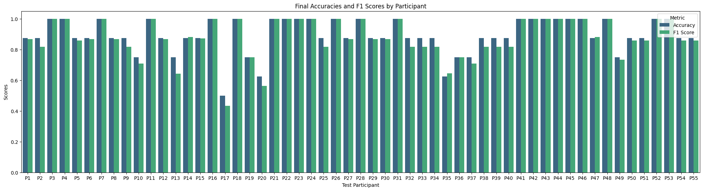

# Adapting Robot's Explanation for Failures Based on Observed Human Behavior in Human-Robot Collaboration

## Overview
This repository contains the implementation of machine learning models used to predict human confusion in a human-robot collaborative environment. The model aims to assess whether a human will be confused based on their interaction with a robot providing explanations for its failure actions.

The models are built and evaluated using data from a user study where participants interacted with a robot that performed tasks like 'Place', 'Carry', and 'Pick' while experiencing failures. The robot provided explanations at various levels, and the human's reactions, including emotions, gaze, and gestures, were recorded and analyzed.

## Project Structure
- **Data/**: Contains the datasets used for training and testing the models.
- **ml/classification_models/**: Machine learning models, including Random Forest, SVM, Neural Networks and many others.
- **predicting.ipynb**: Jupyter notebooks used for demonstrating results.

[//]: # (- - **results/**: Performance metrics, confusion matrices, and other evaluation outputs.)

Each instance in the dataset represents one failure scenario encountered by a participant.

## Model Training
The classification task is to predict whether the participant will be in a state of confusion (binary classification: Confused/Not Confused). The models are trained using:
- **Robot Action** (`A`): The specific action (Pick, Place, Carry).
- **Explanation Decrease** (`D`): Binary indicator of whether the explanation level was decreased.
- **Human Reactions** (`X`): Reactions during both the current and previous failures (emotions, gaze, and gestures).

### Features Used for Training
- **Action**: Robot's task action.
- **Explanation Decrease**: Indicates if explanation level was decreased from previous task.
- **Last Reaction**: Participant's response during the previous failure phase (emotions, gaze, gestures).
- **Failure Reaction**: Participant's response during the current failure phase.

### Models
The following models were implemented and evaluated:
1. **Random Forest** (best-performing model)
2. Logistic Regression
3. XGBoost
4. Support Vector Machine (SVM)
5. Neural Networks
6. ...

The models were trained using leave-one-participant-out cross-validation to assess generalization to new participants. Class balancing techniques were applied to account for imbalanced data (20.5% Confused, 79.5% Not Confused).

## Evaluation Metrics
- **Accuracy**: Measures the overall correctness of the model predictions.
- **F1-Score**: Emphasizes the balance between precision and recall, particularly for the 'Confused' class.
- **Confusion Matrix**: Shows the number of true positives, false positives, true negatives, and false negatives, with a focus on minimizing false negatives to ensure accurate detection of confusion.

### Best Model: Random Forest

- **Hyperparameters**: 
  - Max depth: 10
  - Min samples split: 5
  - Min samples leaf: 10
- **Performance**:
  - Accuracy: 89.54%
  - Precision (Confused class): 0.878
